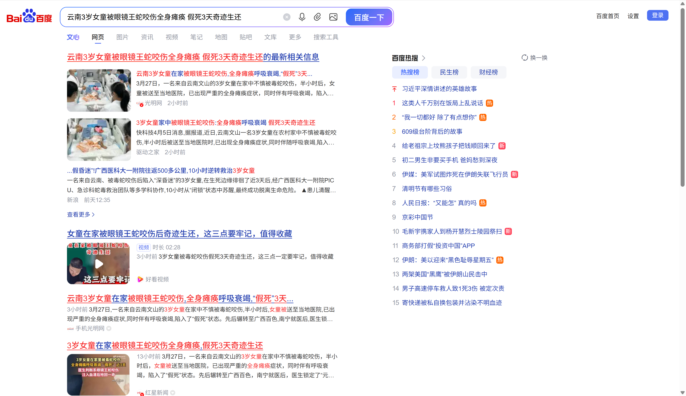
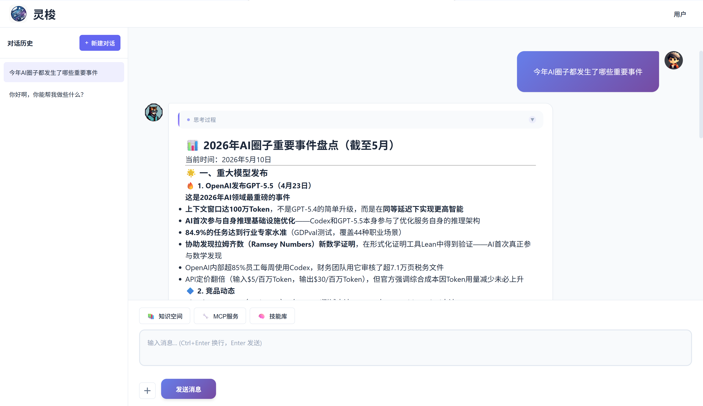
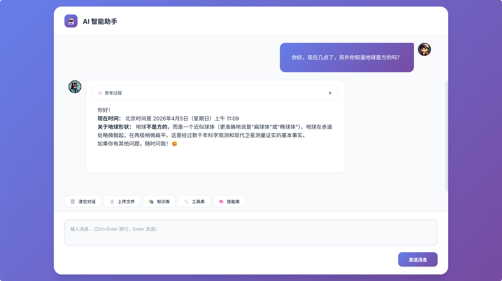
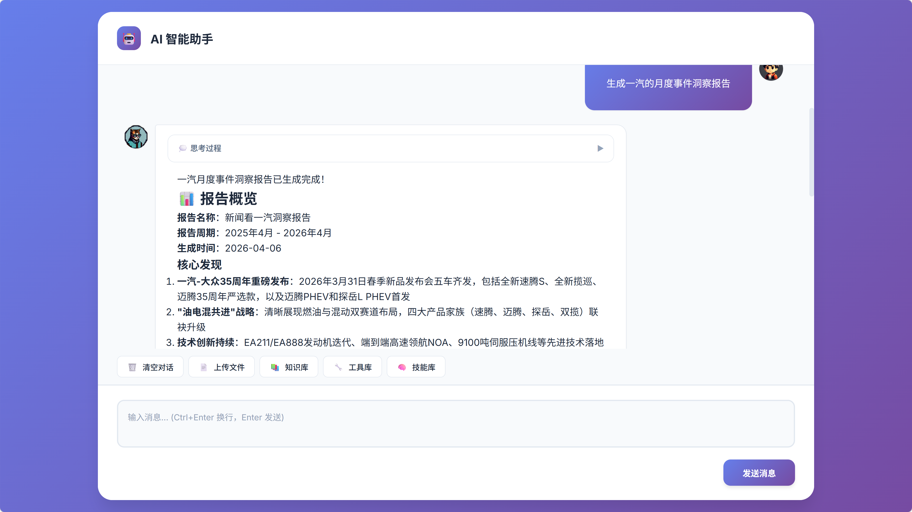

# Spring AI Chat

<div align="right">
  English | <a href="README.zh-CN.md">中文</a>
</div>

> Quickly add a chat interface to your Spring AI application.

[](https://jitpack.io/#com.gitee.wb04307201/spring-ai-chat)
[](https://gitee.com/wb04307201/spring-ai-chat)
[](https://gitee.com/wb04307201/spring-ai-chat)
[](https://github.com/wb04307201/spring-ai-chat)
[](https://github.com/wb04307201/spring-ai-chat)  
  

## Features
- 🤖 AI Chat Interface
- 📚 Knowledge Base (RAG)
- 🔧 Tools (MCP)
- 🧠 Skill Library
- ⚙️ Auto Configuration

## Quick Start: Add Chat Interface
The following example uses Zhipu AI. You can replace it with other LLM dependencies as needed:

### 1. Add Chat Dependency
Add JitPack repository:
```xml
<repositories>
    <repository>
        <id>jitpack.io</id>
        <url>https://jitpack.io</url>
    </repository>
</repositories>
```

Add dependency:
```xml
<dependencyManagement>
    <dependencies>
        <dependency>
            <groupId>org.springframework.ai</groupId>
            <artifactId>spring-ai-bom</artifactId>
            <version>1.1.4</version>
            <type>pom</type>
            <scope>import</scope>
        </dependency>
    </dependencies>
</dependencyManagement>
<dependencies>
    <dependency>
        <groupId>com.gitee.wb04307201.spring-ai-chat</groupId>
        <artifactId>spring-ai-chat-spring-boot-starter</artifactId>
        <version>1.1.16</version>
    </dependency>
</dependencies>
```

### 2. Add Spring AI Dependency
```xml
<dependency>
    <groupId>org.springframework.ai</groupId>
    <artifactId>spring-ai-starter-model-zhipuai</artifactId>
</dependency>
```

### 3. Add Configuration
```yaml
spring:
  ai:
    zhipuai:
      api-key: ${ZHIPUAI_API_KEY}
```

### 4. Start the Project
Visit `http://localhost:8080/spring/ai/chat`


## RAG (Retrieval-Augmented Generation)
The following example uses Redis as the vector database and Tika as the document parsing tool. Add dependencies:
```xml
<dependency>
    <groupId>org.springframework.ai</groupId>
    <artifactId>spring-ai-starter-vector-store-redis</artifactId>
</dependency>
<dependency>
    <groupId>org.springframework.ai</groupId>
    <artifactId>spring-ai-tika-document-reader</artifactId>
</dependency>
```

Add configuration:
```yaml
spring:
  ai:
    vectorstore:
      redis:
        initialize-schema: true
        index-name: custom-index
        prefix: custom-prefix
  data:
    redis:
      host: localhost
      port: 9379
      password: 123456
```

Implement the [IDocumentRead.java](spring-ai-chat/src/main/java/cn/wubo/spring/ai/chat/document/IDocumentRead.java) interface  
For example: [TikaDocumentRead.java](spring-ai-chat-test/src/main/java/cn/wubo/spring/ai/chat/TikaDocumentRead.java)

Restart the project and visit `http://localhost:8080/spring/ai/chat`

File upload and knowledge base buttons will appear.

RAG configuration:
```yaml
spring:
  ai:
    chat:
      ui:
        rag:
          similarityThreshold: 0.50   # Similarity threshold, default 0.0
          top-k: 4                    # Top-k, default 4
          defaultPromptTemplate: |
            Context information is below.

            ---------------------
            {context}
            ---------------------

            Given the context information and no prior knowledge, answer the query.

            Follow these rules:

            1. If the answer is not in the context, just say that you don't know.
            2. Avoid statements like "Based on the context..." or "The provided information...".

            Query: {query}

            Answer:
          defaultEmptyContextPromptTemplate: |
            The user query is outside your knowledge base.
            Politely inform the user that you can't answer it.
```

## MCP (Model Context Protocol)
Taking the time MCP service as an example, add dependency:
```xml
<dependency>
    <groupId>org.springframework.ai</groupId>
    <artifactId>spring-ai-starter-mcp-client</artifactId>
</dependency>
```

Add configuration:
```yaml
spring:
  ai:
    mcp:
      client:
        stdio:
          servers-configuration: classpath:mcp-servers.json
```

```json
//mcp-servers.json
{
  "mcpServers": {
    "time": {
      "command": "uvx",
      "args": [
        "mcp-server-time",
        "--local-timezone=Asia/Shanghai"
      ]
    }
  }
}
```

Configure Chinese labels, descriptions, and default selection for tools. For example:
```yaml
spring:
  ai:
    chat:
      ui:
        tools:
          - name: spring-ai-mcp-client - time
            label: Time
            description:
              A Model Context Protocol service that provides time and timezone conversion functionality. This service enables large language models to obtain current time information and perform timezone conversions using IANA timezone names, with automatic system timezone detection.
            default-selected:  true
```

Restart the project and visit `http://localhost:8080/spring/ai/chat`
Check the tool and input the following content:
```text
1. Current time
2. Get webpage content from `https://www.163.com/`
3. Randomly select one news item from the webpage content obtained in the previous step
4. Open browser and visit `https://www.baidu.com/`
5. Input the news from step 3 into the search box and click search
```




## Skill Library
You can write skills and add them to the skill library. Skills can be configured with parameters and tools. Configuration details:
```yaml
spring:
  ai:
    chat:
      ui:
        skills:
          - name: 【News Watch】Insight Report # Skill name
            description: Collect monthly events on specified topics through web search, generate monthly event insight reports and associated mind maps through in-depth analysis, suitable for enterprise intelligence monitoring, industry trend tracking, etc. # Skill description
            preloading: true # Whether to preload
            tools:
              - spring-ai-mcp-client - time
              - spring-ai-mcp-client - sequential-thinking
              - spring-ai-mcp-client - bing-search
              - spring-ai-mcp-client - fetch
              - spring-ai-mcp-client - mcp-server-chart
              - spring-ai-mcp-client - filesystem
            skill: classpath:skills/news-watch.st
            params:
              - name: param1
                label: Topic
                type: text # select | text | text_area Dropdown | Text | Multi-line text. Dropdown requires options property
                # options: Dropdown options
                #  - label: Hello
                #    value: Hello
                #  - label: 你好
                #    value: 你好
                required: true # Whether required (default: false)
                default-value: Party # Default value
                # placeholder: Input hint
```

```text
Search the web to obtain important monthly events for {param1} in the current year, generate insight reports through in-depth analysis, and create mind maps. Requirements:
- Use @get_current_time to get current time
- Use @sequentialthinking to plan all steps, thoughts, and branches
- Use @bing_search to search for FAW's important events month by month for the current year. Verify with search before each Thinking round
- Use @fetch to view detailed webpage content from search results
- Thinking rounds should be no less than 5, with divergent brainstorming awareness and thinking branches
- Each round needs to reflect on whether decisions are correct based on query results
- Create "News Watch {param1} Insight Report" and use @write_file to save the report as *.md in allowed directories
- After saving the analysis report, return the download URL in format http://localhost:8080/spring/ai/chat/file/download/{fileName}, where fileName is the saved filename. Display using anchor tag, clicking opens new tab for download
- Perform event correlation analysis and use @generate_mind_map to create mind map
- Display the returned mind map URL using img tag with width set to 100%. Clicking the image opens new tab to display the image
```

You can precisely use skills through the skill library button.
If a skill is set to preload, it can also be used directly in conversations.

Restart the project and visit `http://localhost:8080/spring/ai/chat`



