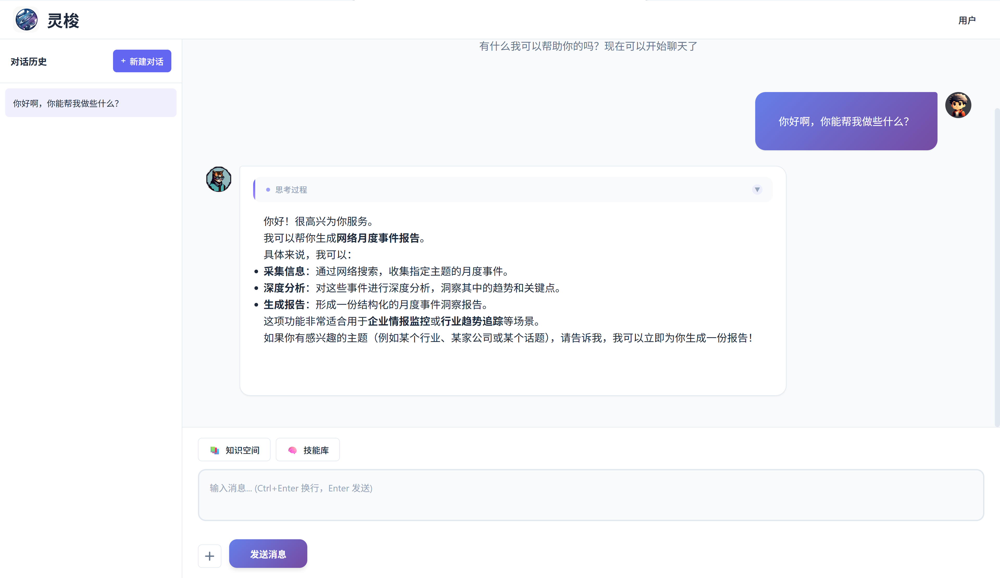
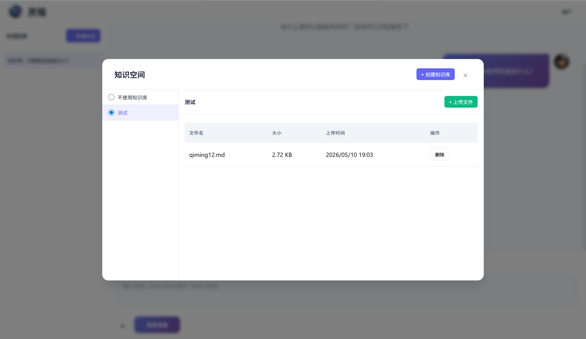
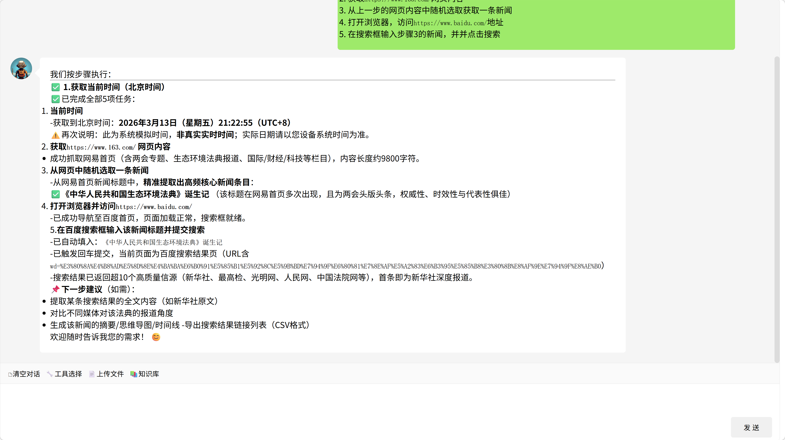
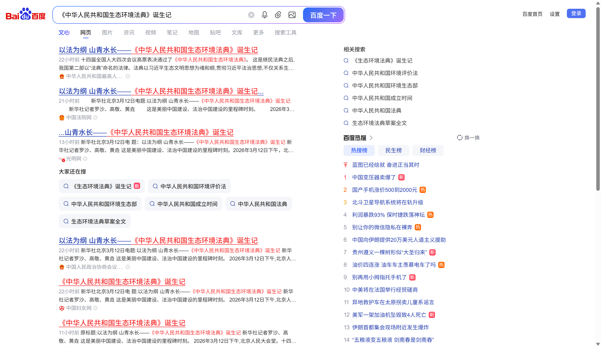

# Spring AI Chat —— Spring AI聊天

<div align="right">
  <a href="README.md">English</a> | 中文
</div>

> 为你的Spring Ai快速添加聊天界面。

[](https://jitpack.io/#com.gitee.wb04307201/spring-ai-chat)
[](https://gitee.com/wb04307201/spring-ai-chat)
[](https://gitee.com/wb04307201/spring-ai-chat)
[](https://github.com/wb04307201/spring-ai-chat)
[](https://github.com/wb04307201/spring-ai-chat)  
  

## 功能特性
- 🤖 AI聊天界面
- 🧠 RAG支持
- 🛠 MCP支持
- ⚙️ 自动配置

## 添加聊天界面
### 添加Spring AI依赖
下面以Zhipu AI为例，添加依赖：
```xml
<dependency>
    <groupId>org.springframework.ai</groupId>
    <artifactId>spring-ai-starter-model-zhipuai</artifactId>
</dependency>
```
添加配置：
```yaml
spring:
  ai:
    zhipuai:
      api-key: ${ZHIPUAI_API_KEY}
```

### 引入聊天依赖
增加 JitPack 仓库：
```xml
<repositories>
    <repository>
        <id>jitpack.io</id>
        <url>https://jitpack.io</url>
    </repository>
</repositories>
```
引入依赖；
```xml
<dependency>
    <groupId>com.github.wb04307201.spring-ai-chat</groupId>
    <artifactId>spring-ai-chat-spring-boot-starter</artifactId>
    <version>1.1.5</version>
</dependency>
```

启动项目 访问`http://localhost:8080/spring/ai/chat`


## 支持RAG
下面以Redis和Tika为例，添加依赖：
```xml
<dependency>
    <groupId>org.springframework.ai</groupId>
    <artifactId>spring-ai-starter-vector-store-redis</artifactId>
</dependency>
<dependency>
    <groupId>org.springframework.ai</groupId>
    <artifactId>spring-ai-tika-document-reader</artifactId>
</dependency>
```

添加配置：
```yaml
spring:
  ai:
    vectorstore:
      redis:
        initialize-schema: true
        index-name: custom-index
        prefix: custom-prefix
  data:
    redis:
      host: localhost
      port: 9379
      password: 123456
```

实现[IDocumentRead.java](spring-ai-chat/src/main/java/cn/wubo/spring/ai/chat/IDocumentRead.java)接口  
例如[TikaDocumentRead.java](spring-ai-chat-test/src/main/java/cn/wubo/spring/ai/chat/TikaDocumentRead.java)

重启项目 访问`http://localhost:8080/spring/ai/chat`

出现上传文件和知识库按钮

rag配置如下：
```yaml
spring:
  ai:
    chat:
      ui:
        rag:
          similarityThreshold: 0.50   # 相似度阈值,默认0.0
          top-k: 4                    # top-k，默认4
          defaultPromptTemplate: |
            Context information is below.

            ---------------------
            {context}
            ---------------------

            Given the context information and no prior knowledge, answer the query.

            Follow these rules:

            1. If the answer is not in the context, just say that you don't know.
            2. Avoid statements like "Based on the context..." or "The provided information...".

            Query: {query}

            Answer:
          defaultEmptyContextPromptTemplate: |
            The user query is outside your knowledge base.
            Politely inform the user that you can't answer it.
```

## 支持MCP服务
以时间MCP服务为例，添加依赖：
```xml
<dependency>
    <groupId>org.springframework.ai</groupId>
    <artifactId>spring-ai-starter-mcp-client</artifactId>
</dependency>
```

添加配置：
```yaml
spring:
  ai:
    mcp:
      client:
        stdio:
          servers-configuration: classpath:mcp-servers.json
```

[mcp-servers.json](spring-ai-chat-test/src/main/resources/mcp-servers.json)

重启项目 访问`http://localhost:8080/spring/ai/chat`
```text
1. 现在的时间
2. 获取`https://www.163.com/`网页内容
3. 从上一步的网页内容中随机选取获取一条新闻
4. 打开浏览器，访问`https://www.baidu.com/`地址
5. 在搜索框输入步骤3的新闻，并并点击搜索
```

